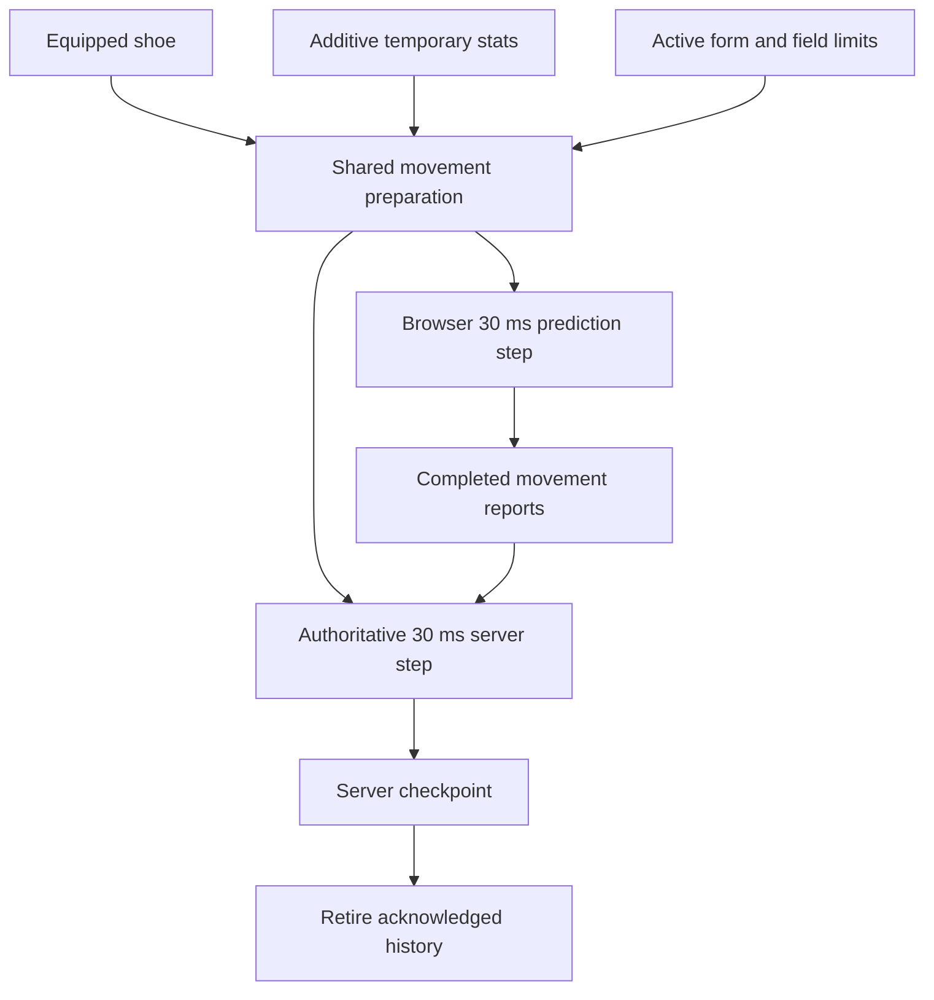

# Online movement parity

The online client and server use the same original-data movement preparation and **30 ms** simulation step. The local client owns its trajectory; the server validates completed steps before they affect the shared world. See the [current movement contract](client-driven-movement.md).

## Cause and correction

The server previously passed `projectCharacterStats()` display totals into `updateSkillMovement()`. That function expects additive temporary bonuses. A normal displayed **100%** became **100 base + 100 bonus**, hitting the speed/jump caps of **140% / 123%**.

| Input or coefficient     | Correct meaning                                          | Owner                         |
| ------------------------ | -------------------------------------------------------- | ----------------------------- |
| Display speed/jump `100` | Total percentage shown by Stat                           | `projectCharacterStats`       |
| Derived speed/jump `0`   | No temporary bonus                                       | `SkillSystem.derived()`       |
| `walkSpeed` at 100%      | 125 world pixels/s                                       | Original Physics.img globals  |
| `jumpSpeed` at 100%      | 555 world pixels/s before gravity                        | Original Physics.img globals  |
| First grounded jump tick | `y = −16.75`, `vy = −495` on the flat regression fixture | Recovered 30 ms integration   |
| Normal upper caps        | Speed 140%, jump 123%                                    | Original normal-player branch |

`updatePlayerMovement(sim, equipment, items, derived)` is the shared movement kernel used by the authoritative server and browser prediction. It first resolves the real shoe's friction/swimming properties, then applies cached temporary skill bonuses and active form rules from original base coefficients. Recasts/cancellation cannot compound an earlier multiplier. The server keeps display/combat totals for their existing consumers.



The browser moves immediately and ordinary acknowledgements only retire history. The server owns the accepted positions used by shared-world actions. The shared helper preserves equipment and buff semantics without expanding the set of supported movement controllers.

## Client-owned motion

The [client-driven movement contract](client-driven-movement.md) supersedes the former
routine checkpoint restore/replay policy. Local 30 ms stepping and interpolation use only
local monotonic time. Completed reports remain ordered through delivery stalls; a shared-kernel
validator reproduces speed, jump/ladder and terrain behavior before accepting their endpoints.

Ordinary acknowledgements never change local XY, velocity, previous XY, held input or the
render phase. The server grants elapsed time, ability versions and one-use hit/skill forces.
Invalid trajectories are rejected; explicit relocation, death, seats, server-controlled
movement and connection recovery retain authoritative continuations. The optional watchdog
cannot disable trajectory validation.

## Latency and input timing

`targetTick` is a consecutive movement-path index within `motionEpoch`, not an arrival
estimate or deadline. The field tick remains the clock for world combat and cooldowns.
Neither RTT nor heartbeat jitter changes local movement speed. Both sides retain a bounded
128-step history/queue; the server validates at most four steps per field tick using
server-measured time. Accepted positions may trail the locally displayed character while
packets are in flight. Range checks and persistence use accepted positions.

## Optimistic presentation policy

Movement, combat presentation and durable operations have separate ownership. Movement
reports must reproduce a legal trajectory. Local attack artwork/audio and provisional damage
can appear immediately, while HP, drops, rewards, resources and cooldowns follow server
admission. Commands still have their existing bounded queues and receipt ordering.

## Local movement correction continuity

Routine movement has no correction curve. The original previous/current 30 ms interpolation
retains its fractional phase across timer wakes, draws after draining due local steps, and
never writes presented coordinates back into physics. Jump sound is triggered by local
acceptance, not by an acknowledgement. The earlier correction-smoothing measurements remain
historical evidence of the replaced implementation.

Explicit denied previews can still use [contact-constrained presentation](../client/src/online/prediction-contact.js).
That policy cannot alter the accepted world position. See the [browser procedure](validation-method.md#combat-latency-check)
for bounded high-ping walking, landing and input-response checks.

## Local combat presentation

[LocalCombat](../client/src/online/local-combat.js) starts the character's attack pose and weapon sound on the outgoing input edge. Skill commands start their authored pose, Use cue and available projectile preview before the reply. The pose uses original avatar frame durations, weapon speed and observed speed buffs. Local action locks expire on that same clock; a delayed confirmation cannot lock movement again or replay a completed pose. Death, seats and server-owned movement transitions retain their authority.

Each preview retains its input sequence or skill operation ID. Combat state, motion locks and weapon/projectile events echo that identity; the browser suppresses only its own matching presentation. Refusal cancels that request's remaining visuals, and field replacement releases timers, animations and leases. Records are bounded to 32 actions and 60 seconds; confirmed records become eligible for removal after five seconds. Damage, HP/MP, ammunition, target selection, knockback, loot and cooldown admission remain server-owned. A predicted flight can miss the eventual authoritative target; it grants no hit, damage number or reward.

**Incoming feedback.** [LocalIncoming](../client/src/online/local-incoming.js) resolves the other half of the exchange. The defender already draws a mob's authored swing from a published action, so when that action reaches its authored `attackAfter` the browser tests the same area rectangle against the same ordinary receiver (`00af14b8`, prone `00af14c8`) and, on overlap, rolls `PhysicalDamage.receive` from the mob's published attack statistic, shows the digit at once and starts the authored flinch face (`PLAYER_HIT.timerMs`). A `bodyAttack` mob is resolved the same way on the first drawn frame its authored body overlaps the player, so simply walking into a monster no longer waits a round trip for its contact tick; both share the authority's hit window (`rejectsHit` refuses every incoming outcome for 1500 ms), so a prediction cannot tick faster than the server's own cadence. This is a presentation prediction only: HP, death and status effects still follow the authoritative `combat.impact`. The digit, flinch, blink, hit sound and provisional recoil play locally; the impact consumes the prediction by actor and reconciles it once (see [local impact feedback](#local-impact-feedback)). A missed or refused authoritative outcome is still shown, so a wrong guess is visible as a correction rather than silently kept. The original client is decisive for outgoing feedback and server-driven for incoming; extending the same local-resolution principle to incoming presentation is an OpenMS latency policy for a 500 ms link, not a recovered Nexon rule, and it is recorded as such here.

**Mob recoil.** The original attacker resolves the mob's reaction and its knockback locally: `0066b6fc` dispatches the reaction from the same call chain as the key press, and `009bbdfd`/`009bc2bb` integrate the recoil as a scalar foothold distance (ordinary 130 px/s braking at 400 px/s², strong 300/200) before `009b1646` maps it back onto the segment tangent. [local-hits.js](../client/src/online/local-hits.js) now starts the same authored profile on the release frame, so the authored `hit1` pose, the damage digit and the recoil all begin together instead of the knockback arriving one round trip later. It is still presentation: the offset drawn is `predicted − authoritative displacement`, so the server's own identical trajectory is never added twice, and a hit the authority never confirms is released over the same braking rate after the reaction window. Flying mobs keep their separate flight controller and are not predicted here.

**Remote skill visibility.** Every admitted cast is visible to the whole field; there is no self-only category. The authority broadcasts the caster's authored phase through [AuthoritySkillResources.playSequence](../server/src/skill-resources.js) (`skill.visual`), a projectile through `onSkillProjectile` (`projectile` + the `ball` visual), each hit through `combat.impact`, and party effects at each recipient through [publishPartyVisuals](../server/src/party-skill-visuals.js). Basic attacks and mob attacks additionally emit `combat.attack`; skill casts do not, so a skill's pose reaches peers through `combatState` and its artwork through `skill.visual`. The client suppresses only its own echo (`local-skill-feedback.js`, `local-projectiles.js`), so a peer can never be hidden by it. Two real gaps were repaired: an event-created visual could be released by an older acknowledged snapshot that predated it (now held for one reconciliation, [native-skill-presentation.js](../client/src/online/native-skill-presentation.js)), and `OnlineUI.cast` dereferenced its local combat owner unconditionally, so a client without one threw before sending the cast.

**Projectile flight.** A skill's ball reached observers only as acknowledged `position` samples chased over a fixed 90 ms window on a different timeline than the thrower's drawn avatar, so it trailed or led the shooter and stepped between snapshots. The authority's flight slot now publishes its authored plan (`flight: {startX,startY,endX,endY,durationMs,delayMs}` on `skillVisual`), and [native-skill-presentation.js](../client/src/online/native-skill-presentation.js) integrates that straight line locally from the plan on receipt, exactly as the thrower's [LocalProjectiles](../client/src/online/local-projectiles.js) preview and the authority's `startFlight`/`stepFlight` both do. The thrower additionally adopts the authoritative plan when its echo arrives and bends onto it at a bounded rate, so both screens show the same trajectory without restarting the ball or snapping it.

Delayed movement is validated in path order. Once its step is accepted, a separate server queue retains the attack **press edge** for up to two seconds, with at most eight queued edges. A press followed by release in one delayed burst is consumed once with its original sequence. Combat uses the current accepted world state and retains attack cadence, resource costs and field ownership. Disconnect neutralization and field changes clear this queue.

### Local impact feedback

Outgoing and incoming previews read `OnlineUI.state.presentation.stats`, the same live server-published stats used by the stat window. The former `owner.hooks.characterStats` access was not connected by the browser entry, so both paths silently skipped all local hits despite unit fixtures supplying that hook.

At an authored release/flight deadline, the local attacker tests the mob's drawn receiver and presents the number, hit pose, original sound and provisional mob recoil. Contact and authored mob areas test the local drawn player immediately. Incoming feedback starts its number, flinch, blink, sound and recoil locally; a field-owned 1500ms protection clock advances once per frame, not once per nearby mob. Dead/spawning mobs and already-protected or dead players cannot start another preview. Audio and digit consumers share one reconciliation decision for each received impact.

[LocalHitMotion](../client/src/online/local-hit-motion.js) owns a separate movement kernel for provisional player recoil. It copies the current local continuation once, applies the original ±270/-270 impulse, follows the same fixed input steps and supplies the drawn position. Unconfirmed recoil does not change outgoing motion reports, HP or inventory. A matching source-tagged server hit adopts the already-presented continuation once; a miss/resisted recoil or four-second expiry eases back to the untouched local movement path. Field changes, death and relocations clear the preview. This is optimistic feedback, not a new client authority over hit admission or damage rolls.

### Remote motion

Peer movement uses the unacknowledged `peers` stream so an application-level state acknowledgement cannot throttle it. Membership, appearance and removal still use ordered `state` frames. Each movement entry carries its source tick, duration, position, velocity, facing, action, contact and an explicit ordinary/snap type. The server retains intermediate samples when publication rotates through a crowded field. An already-owned path ignores movement from membership frames, including newer frames that could otherwise jump ahead of delayed path playback.

[RemotePlayerPath](../client/src/online/remote-player-path.js) implements the [instruction-verified native replay](native-lag-handling.md#movement-implementation-and-instruction-recheck-2026-09-29): packets append duration-bearing elements; a separate fixed-step clock consumes them; Hermite interpolation uses the recorded endpoint velocities. Exhaustion holds the last position and velocity without inventing further movement. Refilling preserves the partial element clock, and facing/action/contact advance with the path. The recovered 30/32 ms catch-up choice depends on accumulated path duration. More than the chosen threshold plus 5000 ms becomes a snap to the newest endpoint, with previous/current render state synchronized. Explicit teleport samples also bypass interpolation regardless of distance.

The player owner-interface trace proves the **550 ms** threshold branch; OpenMS uses it.
The 256-sample storage bound, eight replay calls per browser frame and omitted unchanged
idle samples are documented adaptations. They are not original server rules. Unpaid browser
catch-up remains visible as debt. Server-side overflow is explicit and becomes a relocation
instead of silently losing trajectory samples. Mob presentation still uses
[RemoteMotion](../client/src/online/remote-motion.js)'s existing bounded snapshot forecast;
it is not native character replay.

**Entry freeze.** A still-loading player has no movement samples and holds its spawn, even if its last state says airborne with nonzero velocity. Once ready, its received samples supply the actual fall. A disconnected or dry stream similarly holds its endpoint. Same-field teleport visual events cannot reset a peer path that already owns the explicit relocation.

**Attack target timing.** Drawing remote actors in the past means the player also aims at their past position. Two mechanisms keep combat fair without giving the client damage authority. Outgoing selection tests the mob's receiver as the **union of its current and previous position** — the original `00678476` selects through `00664559(...,1)`, which unions the same facing rectangle at `+0x510/+0x514` and `+0x518/+0x51c` — so one tick of target motion cannot carry a body out of a swing. On top of that, the authority widens the same sweep across the view window the attacker was rendering (`attackRewindTicks` in [field-combat.js](../server/src/field-combat.js)), derived from the acting connection's **measured round trip** half plus a bounded playout allowance, capped at **16 ticks**. The window is server-measured, never client-claimed, and bounded, so it cannot become a range cheat. With compensation in place the playout delay costs combat accuracy nothing, so the presentation can keep favouring smoothness over latency. Damage, HP, death, loot and rewards remain server-owned.

Remote animation clocks advance between publications, and a dropped frame may advance them by at most **two 30 ms quanta** so a hitch cannot jump an animation through the gap. Delayed copies of the same attack retain the furthest presented phase; a new action/start tick resets it. The field-owned visual clock stops during pause/inactive presentation, including confirmed pickup arcs. No predicted position or action is written back into server entity state. Drops use their separate [known flight and hover plan](drop-motion.md#online-presentation-through-delayed-updates), which can continue beyond the remote actor's buffer horizon.

The [remote motion check](validation-method.md#remote-player-and-drop-check) exercises two native browser clients under delayed delivery. The character renderer never predicts another player's future keys. It replays the authority's supported motion; original packed movement types beyond ordinary paths and explicit snaps are not implemented. The [combat latency check](validation-method.md#combat-latency-check) covers local combat and the simpler mob forecast. Neither establishes original Windows runtime parity.

## Portals and transitions

The local player is presented from its own prediction, never from the remote interpolator — including while the transport is `transitioning` or `synchronizing`. Drawing the self from received publications would place it at a delayed server snapshot and throw its coordinates before the map changes. While a transition is pending the prediction is simply not stepped, so the character holds its portal position; its coordinates change at the destination install.

A **same-map** portal or teleport is the authority's own relocation, delivered as an observed `world.teleport` event. The client adopts it into the prediction kernel with the same `relocateSimulation` the authority applies, so the next predicted step extends the arrival instead of pulling the player back to the pre-portal position. Cross-map travel replaces the predictor outright from the destination snapshot.

## Skill snapshot continuity

The September 14 follow-up traced three independent failures in the real online path:

- Every paid skill publishes a profile snapshot. `main.install` previously recreated the local physics state even when the character, connection and field had not changed, losing the current impulse, contact state, interpolation anchor and input history. Same-field refreshes now preserve all of these while retaining lifecycle ownership until presentation work completes.
- `OnlineUI.optimisticImpulse` was passed the `OnlineScene` wrapper, whose physics lives on its nested `scene`. Facing resolved to zero, so the apparent optimistic path never started. It now reads the actual local simulation. Rank-20 Flash Jump begins with the recovered `±550/-350` px/s request before its receipt; its server echo is consumed once.
- A pending skill or inventory transaction incorrectly asserted position ownership. Only an actual field transition does so. Ordinary action locks and ladder movement retain client XY. The watchdog still records deviations and disconnects impossible or repeated suspicious movement.

The local cast gate avoids grounded, locked and insufficient-MP impulse attempts. A per-airborne-use latch and the original grounded impulse recovery prevent repeated keys from restarting the jump; a response from a departed field cannot restore an obsolete checkpoint.

Consecutive Flash Jump effects retain the same prepared animation resource, but each restart now publishes a distinct `playbackId`. The browser resets the new playback to its own origin instead of interpolating from the previous cast. The original `Effect.wz:BasicEff.img/Flying/` sequence lasts 600 ms; rapid landing/jump repetitions can restart it before expiration. A native keyboard reproduction measured a 221 px offset before this repair. WZ frame offsets and facing remain unchanged. [Original movement-effect dispatch](ghidra-physics-motion/time-loop/0097fdf8.c.txt) selects `Flying`/`Flying1` and the character's position for each trigger. The shared skill controller also records the physics `groundJumpSequence` when consuming Flash Jump, allowing a new ground jump even if a profile transaction suspended the skill clock across the landing.

The focused check below now covers three ordinary airborne casts plus two rapid consecutive casts, inspecting rendered effect origins, replay identity and screenshots. `skill-projectile-chase.test.js` retains interpolation within a playback and verifies that restart cancels an unfinished chase; `skill-visual-replay.test.js` exercises the actual WZ sequence and wire schema.

Flash Jump admission also waits for movement packets already queued ahead of its command to reach their scheduled field tick. Previously an immediate jump/cast could be checked against the preceding grounded state and rejected. The client still applies its impulse at input time; the server never advances physics from a command. The bounded wait captures one target tick, checks field/connection continuity, and rejects stalled or paused clocks before costs are paid.

[Native browser report](validation/skill-motion/report.json) records three successful airborne Flash Jumps in Henesys using real keyboard input, the original packaged WZ artwork, and the production server with disposable account/database state. [Frame samples](validation/skill-motion/frames.json) show zero regressing prediction ticks, zero unready/loading frames and no authoritative position frames during these casts. [Validation results](validation.md#skill-cast-stutter-repair) retain the measurements and earlier failures.

```sh
bun server/tools/check-skill-motion.js --output /tmp/openms-skill-motion
bun test client/test/online-skill-motion.test.js client/test/divert-alignment.test.js server/test/motion-adoption.test.js
```

The original executable was freshly decompiled with `docs/tools/knockbackFocus.java`. [Full output](ghidra-client/knockback-trajectory.txt) retains `007a6353` (player impulse merge), `009bbdfd` (mob recoil), `0066b6fc` (reaction dispatch) and `00950921` (skill dispatch containing the movement branches). Ground recoil at `009bc2bb..392` integrates scalar foothold distance; `009b1646` maps it to world XY using the normalized tangent. A prior partial report misidentified the separate airborne mode-3 branch as ordinary ground recoil; that interpretation and the associated slope test are corrected. Ordinary recoil remains 130 px/s with 400 px/s² braking; strong recoil remains 300/200. Player recoil remains the recovered ±270/-270 impulse, subject to its existing hit/resistance gates.

Original `Skill.wz` supplies Flash Jump 4111006 rank-20 MP cost 13 and prerequisite 4111005 level 5. The supplied Cosmic reference `src/main/java/net/server/channel/handlers/MovePlayerHandler.java:39` reads the player's reported movement, updates the map position and broadcasts it to other players; it is supporting emulator evidence, not Nexon source. No original C/C++ source is present in the supplied client directory. These results do not establish Windows runtime parity or all special mob controllers.

## Source evidence

| Evidence                            | Location                                                                                                                                            |
| ----------------------------------- | --------------------------------------------------------------------------------------------------------------------------------------------------- |
| Original globals and motion quantum | [Decoded WZ globals](ghidra-physics-motion/wz-globals.json) · [Physics evidence](physics-evidence.md)                                               |
| Normal movement and caps            | Native `0094d8f1..0094d9be`                                                                                                                         |
| Form and shoe coefficients          | Native `0094d3d9`, `005cac3d`, `0094da00`                                                                                                           |
| Field-limit override                | Native `0094d311`                                                                                                                                   |
| Player impulse merge                | Native `007a6353` · [Knockback trajectory](ghidra-client/knockback-trajectory.txt)                                                                  |
| Ground mob recoil                   | Native `0066b6fc` / `009bbdfd` · [Knockback trajectory](ghidra-client/knockback-trajectory.txt)                                                     |
| Shared implementation               | [skill-movement.js](../client/src/physics/skill-movement.js)                                                                                        |
| Client / server call sites          | [prediction.js](../client/src/online/prediction.js) · [world.js](../server/src/world.js) · [motion-authority.js](../server/src/motion-authority.js) |
| Wire continuation                   | [motion.js](../shared/motion.js) · [Protocol checkpoints](server/protocol.md#motion-checkpoints)                                                    |

## Scoped verification

### Jump audio and midair attacks

| Symptom                                  | Cause                                                                                                                                                       | Current behavior                                                                                                                                                                                                                                                                      |
| ---------------------------------------- | ----------------------------------------------------------------------------------------------------------------------------------------------------------- | ------------------------------------------------------------------------------------------------------------------------------------------------------------------------------------------------------------------------------------------------------------------------------------- |
| Jump sound delayed by ping               | Sound was cued only when the server confirmed `groundJumpSequence`. | `OnlinePrediction` cues original `Game/Jump` when forward local physics accepts the jump. Native `009b1d3d` also dispatches its sound locally. Checkpoints, replay and initial/rejoin baselines stay silent; ineligible presses produce no sound. |
| Quick jump taps occasionally disappear   | Physical input retained the edge, but online conversion copied only the already-released held state. | The next transmitted/predicted sample preserves `jumpPressed`, then releases normally. Native `0094c383` similarly latches a request for the next movement step. |
| Position steps when attacking midair     | An action lock switched the local avatar from prediction to older entity interpolation; the 90ms entity snapshot also overwrote the 30ms checkpoint's lock. | Local presentation continues using the predictor through an action lock. The shared motion kernel suppresses input while continuing gravity/inertia; the latest server checkpoint owns the lock. Local attack pose uses the client action clock; hits and damage remain server-owned. |
| Stationary peer climbing keeps animating | The online peer path reseeked the climb sequence without applying the original consecutive-Y hold branch.                                                   | `ladder`, `rope`, `ladder2` and `rope2` hold their current frame while consecutive authoritative Y positions match, then resume when Y changes. Other actions never inherit the hold.                                                                                                 |

This follows the lock/integration order in `physics/simulation.js` and the retained original `00452792..004527d3` ladder/rope action and consecutive-Y comparisons. No original physics coefficients changed; the remote presentation change is limited to the recovered climb-frame hold. The online read-only snapshot includes audio state and output-capture diagnostics for reproducing sound failures.

The targeted regressions in `client/test/sync-alignment.test.js` cover accepted jumps, duplicate/rejoin suppression, uint32 sequence wrap, motion continuity through a midair action lock, and stationary-versus-moving peer climb frames. `bun server/tools/check-entry-repairs.js` additionally uses native jump/attack input and captures actual audio output with fixture music muted; it reuses assets and owns disposable accounts/database/listeners.

```sh
bun test server/test/movement-parity.test.js client/test/sync-alignment.test.js client/test/physics.test.js
```

The original coefficient repair's retained run passed **33 tests, 795 assertions**. Its regression invokes the real `OnlineWorld.moveActor` path and compares every walking/jumping tick with the shared preparation and integration fixtures. It covers 100%, buff replacement/cancellation, shoe friction/swimming coefficients, anti-slip shoes, riding forms, restricted fields and received checkpoint continuation. Current focused tests cover validated paths without ordinary reconciliation, presentation isolation and motion boundaries; jump/audio regressions extend that coverage.

Geometry and buff inputs are explicit isolating fixtures; original globals are independently decoded. This is executable kernel/server parity proof, not a new Windows capture or a network-latency benchmark. Restart both development commands after this runtime change so rules identities match.
